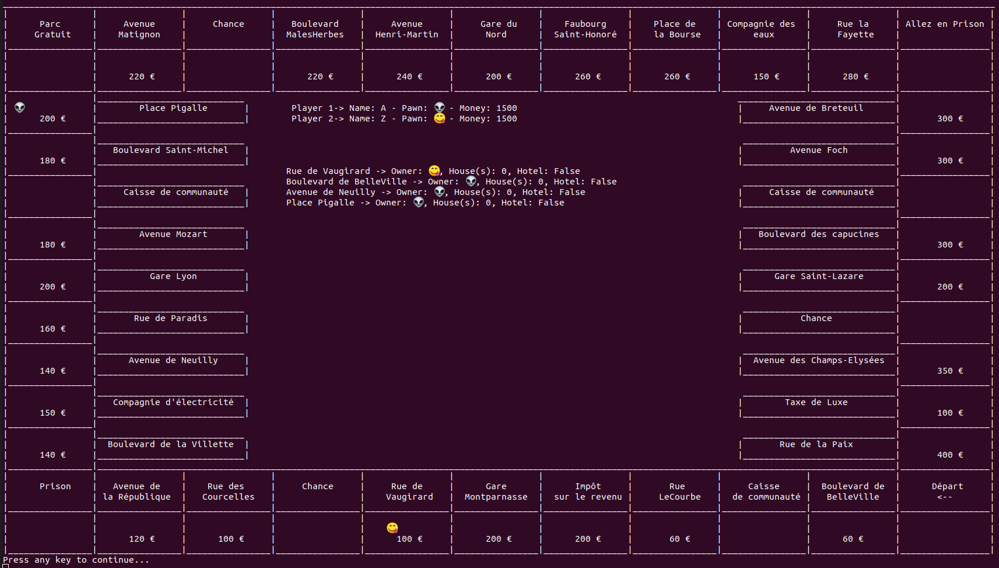

# Monopoly

This game is a final project of a design pattern course.

* About the game
* Design Pattern view
* Usage

### About the game

The implementation of this game can be played from 2 to 6 players.
The players and the board are both chained lists in order to don't use any counter for each round of the game.
On every round the user can see which player he is and the amount of money he have.
The bought properties will be displayed on the screen with the number of houses and if there is a hotel on it.


The player is structured with the following args:
 * Id
 * Names
 * The amount of money they have
 * Their position which is copy of the board so basically a chained list
 * Their 3 last thrown dices (represented with a Queue)
 * A list of id's of the properties they bought
 * 3 booleans to know if the player is in it's first round, jail and if he has got a card to go out of jail


Every player is represented by a pawn with an emoji which is easier to see in the terminal.

The board is chained list where each element of the list is based on the "Street" class which inherit from Buyable and Case classes. This class is based with:

 * Id
 * Names
 * Basic price (the price of the box when nobody has it)
 * Color (the rent of the properties are doubled when a player own all the properties with the same color)
 * Number of house(s)
 * A boolean to know if there is a hotel
 * A list of rent amounts
 * House's price
 * Hotel's price


The data board is extracted from a txt file which is `data_case.txt` so the game can be modified to another version of the Monopoly easily.

This project is based on this version of Monopoly:


The result shown to the user is the following:



### Design Pattern view

This project contain 3 different design patterns.
* Factory
* Singleton
* Mode Viewer Controller (MVC)

The factory pattern is used to create each box of the game. With this pattern, we no longer need to create new instances of a class, just call a function that `getCase()` from the class CaseFactory by specifying the type of box we want. The function enters the necessary parameters according to this type.

The singleton pattern is used for the banker and the deck of community and chance cards. With this one, we create only one instance of the class because there is no more than one banker or deck of cards.  We call a function to create the banker or the deck and if it is already created it return the existing one.

The MVC pattern is classical. There is 3 classes, the model which contains the players and the board. The controller to affect any changes on the instance model. The viewer which display the changes of the game to the user.

### Usage

First of all, clone the repository on your computer and install **dotnet** if you don't have it.

To run the game just exectue the following line:
```
dotnet run
```

But before running the game launch a test to know if the code works:
```
dotnet run --test
```
A verbose mode is available with the option -v, each box of the board will be displayed. You will be able to check if the data used is correct.
```
dotnet run --test --v
```
